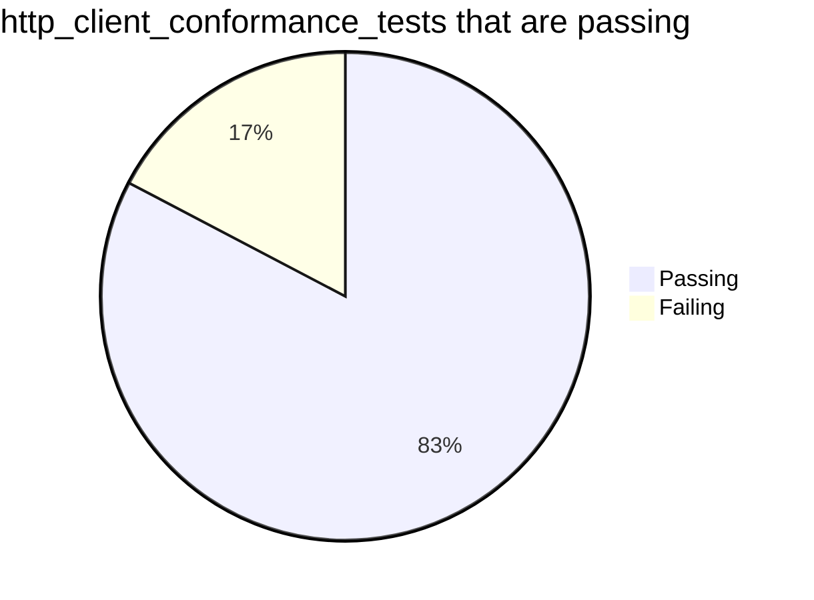

# [Alex James'](https://github.com/alex-james-dev) Google Summer of Code (GSoC) 2023 Project

During the summer of 2023, I had the privilege of working with [Brian Quinlan](https://github.com/brianquinlan) & [Hossein Yousefi](https://github.com/HosseinYousefi) from the `Dart` programming language team to develop a new `HTTP` client for `Dart`.

---

**GSoC Project**: [Build a Dart HTTP client using Java APIs](https://summerofcode.withgoogle.com/programs/2023/projects/NKUQqmSA)

**GSoC Contributor:** [Alex James](https://github.com/alex-james-dev)

**GSoC Organization:** [Dart Programming Language](https://summerofcode.withgoogle.com/programs/2023/organizations/dart)

**GSoC Mentors:** [Brian Quinlan](https://github.com/brianquinlan) & [ Hossein Yousefi](https://github.com/HosseinYousefi)

**Project's GitHub Repo:** [java_http](https://github.com/dart-lang/http/tree/master/pkgs/java_http)

## Project Description

Create a new HTTP client for the Dart programming language that conforms to the `package:http` [Client](https://pub.dev/documentation/http/0.13.6/http/Client-class.html) interface and uses native Java HTTP APIs through [package:jnigen](https://github.com/dart-lang/jnigen). Using native Java HTTP APIs will allow us to provide several key features requested by our users, such as:

1. **Using the system-configured proxy** [(#50434)](https://github.com/dart-lang/sdk/issues/50434).

2. **Honouring user-installed and user-disabled certificate authority (CA) certificates** [(#50435)](https://github.com/dart-lang/sdk/issues/50435).

3. **Supporting KeyStore PrivateKeys** [(#50669)](https://github.com/dart-lang/sdk/issues/50669).

## Project Goals

- Determine the Java HTTP APIs we will use in the new `Dart` HTTP client.

- Generate `Dart` bindings for the Java HTTP APIs using [package:jnigen](https://github.com/dart-lang/jnigen).

- Write a higher-level interface over the [package:jnigen](https://github.com/dart-lang/jnigen) generated bindings so that we can use `Dart` classes instead of `Java` classes when using the bindings, e.g. we want to use `Dart`'s [Uri](https://api.dart.dev/stable/3.1.0/dart-core/Uri-class.html) class instead of [java.net.URI](https://developer.android.com/reference/java/net/URI) when working with URLs.

- Create `java_http`, a new HTTP client for the `Dart` programming language, that uses the higher-level interface over the [package:jnigen](https://github.com/dart-lang/jnigen) generated bindings.

- The `java_http` client must implement the existing `package:http` [Client](https://pub.dev/documentation/http/0.13.6/http/Client-class.html) interface; this enables existing `package:http` users to switch to `java_http` without changing any of their existing code!

- Make `java_http` pass all of the **52** existing tests in `package:http_client_conformance_tests`.

- If necessary, add any missing tests to `package:http_client_conformance_tests` to validate `java_http`'s implementation.

- Release `java_http` version `0.1` to users!

## The Code I Wrote

The `Dart` team merged the code I wrote during GSoC 2023 upstream into the [`java_http`](https://github.com/dart-lang/http/tree/master/pkgs/java_http) repo, which is inside the [dart-lang/http](https://github.com/dart-lang/http) mono repo. We merged my code in a series of small but frequent pull requests as recommended by Google's [Engineering Practices Documentation](https://google.github.io/eng-practices/review/developer/small-cls.html).

You can find all the code I wrote during GSoC 2023 in the following GitHub pull requests:

|       | Pull Request | Summary | Status |
| :---: | :----------- | :------ | :----: |
| 1. | [**Create java http package** (#971)](https://github.com/dart-lang/http/pull/971) | <ul><li>Created a new empty Dart package called `java_http` using the `dart create` command.</li></ul> |  |
| 2. | [**Java http BaseClient implementation** (#980)](https://github.com/dart-lang/http/pull/980) | <ul><li>Generated Dart bindings for `java.net.URL`. </li> <li>Created `JavaClient`, a subclass of `package:http` `BaseClient`. </li> <li>Implementented `BaseClient.send()` method.</li><li>Initialised the JVM using `package:jni`.</li> <li>Created a `java.net.URL` object using the generated bindings. </li><li> Created the test file for `JavaClient`. </li><li>Created a new GitHub workflow file to automatically run the tests.</li> |  |
| 3. | [**Java http send method** (#987)](https://github.com/dart-lang/http/pull/987) | <ul><li>Set the request headers.</li><li>Set the request method.</li><li>Connect to the URL.</li><li>Send the request.</li><li>Retrieve the response status code.</li><li>Retrieve the response reason phrase.</li><li>Retrieve the response response headers.</li><li>Retrieve the response content length.</li><li>Retrieve the response body.</li></ul> | |
| 4. | [**[java_http] send request body** (#995)](https://github.com/dart-lang/http/pull/995) | <ul><li>Send the HTTP request body to the server (POST request).</li></ul> |  |
| 5. | [**Add java_http .gitattributes file** (#999)](https://github.com/dart-lang/http/pull/999) | <ul><li>Hide `jnigen` generated code in GitHub diffs.</li></ul> |  |
| 6. | [**Remove example test from java_http** (#1001)](https://github.com/dart-lang/http/pull/1001) | <ul><li>Remove the example test that was generated by the `dart create` command.</li></ul> |  |
| 7. | [**JavaClient can stream the HTTP response body** (#1005)](https://github.com/dart-lang/http/pull/1005) | <ul><li>Stream the HTTP response body one byte at a time</li><li>Supports HTTP response bodies of unbounded size!</li><li>Handle `ClientException`s when getting the HTTP response status code.</ul> |  |
| 8. | [**JavaClient stream response body using byte arrays** (#1007)](https://github.com/dart-lang/http/pull/1007) | <ul><li>Streams the HTTP response body using byte arrays.</li><li>Significantly improves performance.</li><li>Generated `Dart` bindings for `java.io.BufferedInputStream`.</li><li>Make getting the HTTP response body asynchronous.</li></ul>  |  |
| 9. | [**Add response status code test** (#1009)](https://github.com/dart-lang/http/pull/1009) | <ul><li>I added a new test called `without status code` to 'package:http_client_conformance_tests'.</li><li>The `without status code` test checks that `package:http` clients can handle an HTTP response status line with a missing status code.</li></ul> |  |

I tracked the pull requests I opened during GSoC 2023 in a GitHub issue:

[**Create a new package:http Client based on Java APIs** (#957)](https://github.com/dart-lang/http/issues/957).

## http_client_conformance_tests

The test file for `java_http` can be found [here](https://github.com/dart-lang/http/blob/master/pkgs/java_http/test/java_client_test.dart). This file shows the `package:http_client_conformance_tests` that are run when we execute `dart test`. Currently, `java_http` is passing **43** out of the **52** tests in `package:http_client_conformance_tests`.


### http_client_conformance_tests that are passing


The `java_http` client passes the following tests from `package:http_client_conformance_tests`:

|     |    Test Group   | Test Purpose | Number of Tests |
| :---: | ----------------| ------------ | :---------------: |
|  1. | **testIsolate** | Tests that `java_http` is useable from Isolates other than the main isolate. | 1 |
|  2. | **testResponseBody** | Tests that `java_http` correctly implements HTTP responses with bodies. | 3 |
|  3. | **testResponseBodyStreamed** |Tests that `java_http` correctly implements HTTP responses with bodies of unbounded size. | 1 |
|  4. | **testResponseHeaders** | Tests that `java_http` correctly processes response headers. | 17 |
|  5. | **testResponseStatusLine** | Tests that java_http correctly processes the response status line. | 1 |
|  6. | **testRequestBody** | Tests that `java_http` correctly implements HTTP requests with bodies (POST requests). | 14 |
|  7. | **testRequestHeaders** | Tests that `java_http` sends request headers correctly. | 5 |
|  8. | **testMultipleClients** | Tests that `java_http` works correctly when multiple `java_http` clients are used simultaneously. | 1 |
| | | | Total: **43**|

### http_client_conformance_tests that are failing

The `java_http` client fails the following tests from `package:http_client_conformance_tests`:

|     |    Test Group   | Test Purpose | Number of Failed Tests / Number of passed tests|
| :---: | ----------------| ------------ | :---------------: |
|  1. | **testClose** | Tests that `java_http` correctly implements the [`Client.close()`](https://pub.dev/documentation/http/0.13.6/http/Client/close.html) method. | Fails 1/4 tests |
|  2. | **testCompressedResponseBody** | Tests that `java_http` correctly implements compressed HTTP response bodies. | Fails 2/3 tests |
|  3. | **testServerErrors** | Tests that `java_http` correctly handles server errors. | Fails 2/2 tests |
|  4. | **testRedirect** | Tests that `java_http` correctly implements HTTP redirect logic. | Fails 4/6 tests |
| | | | Total failed: **9**|

### New http_client_conformance_tests

I added a new test to 'package:http_client_conformance_tests' which tests that `package:http` clients correctly handle an invalid HTTP response that does not include an HTTP status code. I created this test because a line of code in `java_http` wasn't being covered by the existing test suite. This new test not only benefits `java_http` but all the current and future `package:http` clients. You can find the code for the new test in this PR: [**Add response status code test** (#1009)](https://github.com/dart-lang/http/pull/1009)

## jnigen

I generated Dart bindings for the following `java` classes using [package:jnigen](https://github.com/dart-lang/jnigen):

- `java.io.InputStream`
- `java.io.OutputStream`
- `java.lang.System`
- `java.net.HttpURLConnection`
- `java.net.URL`
- `java.net.URLConnection`

You can generate Dart bindings with jnigen by creating a yaml file and running `dart run jnigen --config jnigen.yaml`.

For `java_http`, I generated Dart standalone bindings. We chose to develop `java_http` as a standalone `Dart` package instead of an Android plugin, making automated testing easier and significantly faster. The faster tests resulted in a quicker development cycle. `java_http` executes its tests more quickly than the other `package:http` clients.

<p align="center">
    
</p>

<p align="center">
java_http is the fastest at executing the tests!
</p>

## Android Studio Network Inspector

HTTP requests sent using `java_http` automatically appear in Android Studio's Network Inspector due to `java_http` using native `Java` APIs. `java_http` is the only `Dart` HTTP client that provides this functionality! `package:http` users have requested this feature: [**Support Android Studio Network Inspector** (#946) ](https://github.com/dart-lang/http/issues/946).

<p align="center">
    
</p>

<p align="center">
java_http requests appear in Android Studio's Network Inspector.
</p>

## What's left to do

Before we can launch version `0.1` of `java_http` we need to:

- Pass the **9** remaining tests of `package:http_client_conformance_tests` that are currently failing.

- Update the README.

- Add a dartdoc comment to java_client.dart which describes the implementation.

- Add an example [(GitHub issue)](https://github.com/dart-lang/http/issues/982).

- Remove `java_http_base.dart` [(GitHub issue)](https://github.com/dart-lang/http/issues/982).

- Handle the exception thrown in the worker isolate when parsing the response content-length header.

### Code Refactoring

- Move the `initJVM()` method call to `JavaClient`'s constructor.

- Refactor the methods in `java_client.dart` to be extension methods. For example,

```dart
final reasonPhrase = _reasonPhrase(httpUrlConnection);
```

would become:

```dart
final reasonPhrase = httpUrlConnection.reasonPhrase;
```

- Add missing trailing commas to the `java_http` codebase.

## Challenges

1. Making `java_http` stream the HTTP response body was the most challenging part of my GSoC project. I had to learn about isolates, how to create streams and asynchronous programming with Dart. Although I found it difficult, it was gratifying when I implemented the functionality.

2. A GitHub workflow bug provided another exciting challenge. The tests were passing locally but not on the GitHub workflow! I enjoyed working with the mentors to debug and resolve this issue.

## Things I learned

- Dart

- Git

- GitHub Actions

- Test-driven development (due to package:http_client_conformance_tests)

- How to write clear and concise GitHub pull request messages

## Acknowledgements

A big thank you to my mentors [@Brian Quinlan](https://github.com/brianquinlan) & [@Hossein Yousefi](https://github.com/HosseinYousefi) for all their help and support over the summer! I had a terrific time and would like to work with the team again next summer.
